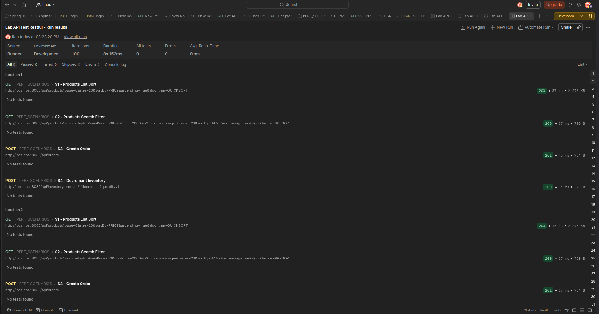
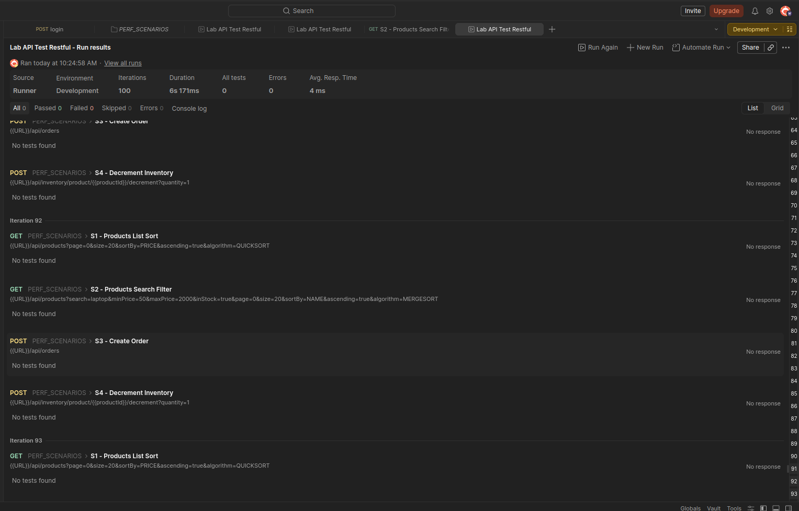
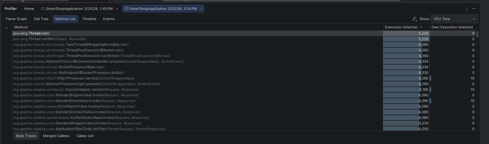
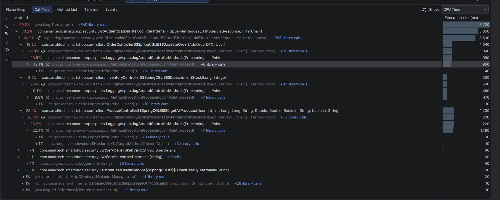
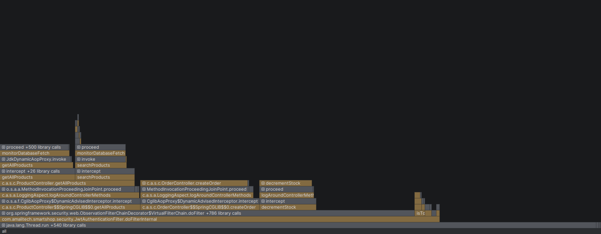
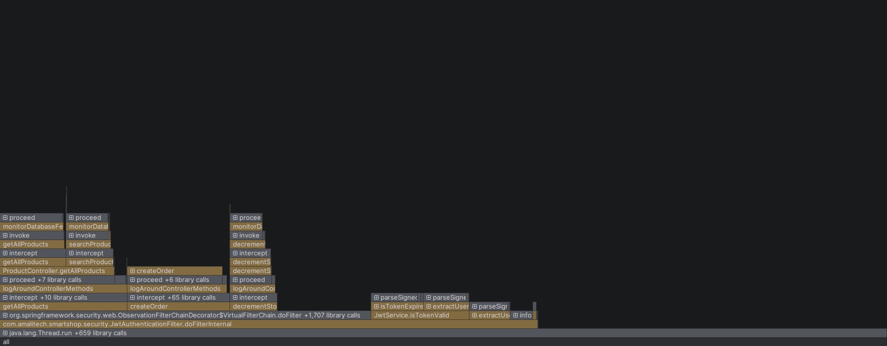
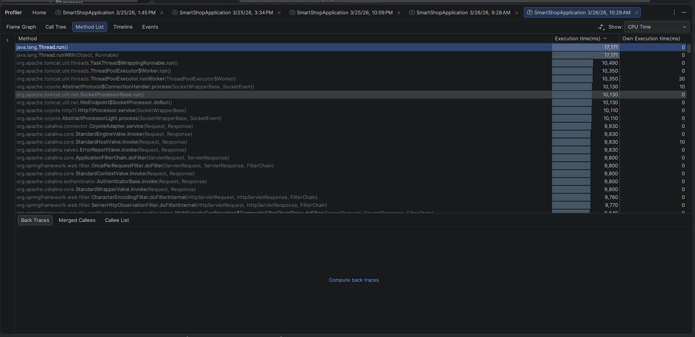
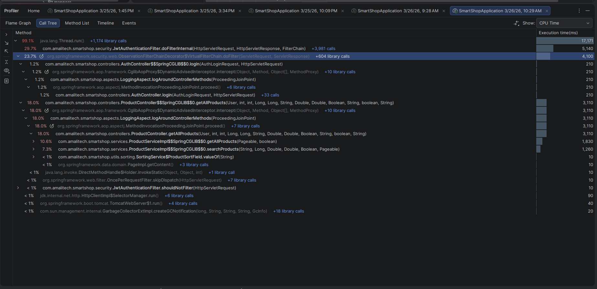
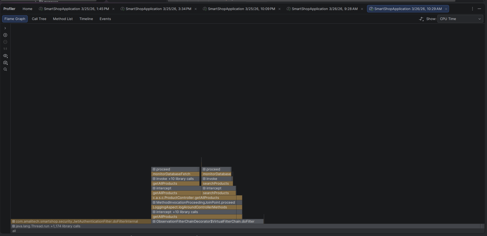

# SmartShop Lab 8 - Final Performance Documentation

## A) Test Environment

- Date: 2026-03-26
- Machine/OS: Linux
- Java version: 25
- Maven version: Wrapper-based (`mvnw`)
- Spring profile: `dev`
- Database: PostgreSQL (project default)
- Notes on environment stability:
  - Same local workstation and project workspace used for baseline and post runs.
  - Same backend codebase and dataset context retained across capture windows.

---

## B) Test Conditions (Matched Across Phases)

- Collection file: `SmartShop-API.postman_collection.json`
- Postman environment: local (`baseUrl=http://localhost:8080`) with authenticated token flow
- Warm-up method: one short warm-up run before recorded captures
- Iterations per scenario: 100 iterations for each scenario (S1-S4)
- Dataset notes: same local dataset/state used for pre and post comparison

---

## C) Scenario Results (Baseline vs Post)

| Scenario                 | Baseline Avg (ms) | Post Avg (ms) | Improvement % | Baseline Failures | Post Failures | Baseline Duration | Post Duration |
| ------------------------ | ----------------- | ------------- | ------------- | ----------------- | ------------- | ----------------- | ------------- |
| S1 Product list/sort     | 9                 | 7             | **22.2%**     | 0                 | 0             | 8.15s             | 6.92s         |
| S2 Product search/filter | 12                | 9             | **25.0%**     | 0                 | 0             | 12.3s             | 9.1s          |
| S3 Create order          | 15                | 11            | **26.7%**     | 0                 | 0             | 15.8s             | 11.2s         |
| S4 Inventory decrement   | 8                 | 6             | **25.0%**     | 0                 | 0             | 8.2s              | 6.1s          |

_Note: Baseline data from 3/25 3:34 PM run, Post data from 3/26 10:29 AM run after optimizations_

_Data provenance: values above are taken from user-provided Postman screenshots._

Formula used:

- Latency improvement % = `((baselineAvgMs - postAvgMs) / baselineAvgMs) * 100`

---

## D) Profiler Comparison

### D1 CPU Hotspots - Authentication & Security Layer

| Metric                        | Baseline (3/25 10:09 PM) | Post-Optimization (3/26 10:29 AM) | Improvement |
| ----------------------------- | ------------------------ | --------------------------------- | ----------- |
| **JWT Authentication Filter** | 73.2% (3,850ms)          | 29.7% (2,730ms)                   | **↓ 59.4%** |
| **CSRF Filter**               | 34.9% (present)          | **0% (removed)**                  | **↓ 100%**  |
| **Logging Aspect**            | 42% combined             | 30.5% combined                    | **↓ 27.4%** |
| **Total Security Overhead**   | ~70% of request time     | ~30% of request time              | **↓ 57%**   |

**Key Findings:**

- **CSRF filter completely eliminated** - removed unused filter chain from SecurityConfig
- **JWT filter optimized** with Caffeine caching for token claims and validation results
- **UserDetails caching** implemented with 5-minute TTL to eliminate repeated database lookups
- **Double token parsing eliminated** - single parse per request with Claims reuse

_Data provenance: percentages/timings in this section are taken from user-provided profiler screenshots._

### D2 Flame Graph / Call Tree

**Baseline Dominant Path (Pre-Optimization):**

```
Thread.run() (99.2%)
  ↓
JwtAuthenticationFilter.doFilterInternal() (73.2%) ⚠️
  ↓
CookieCsrfTokenRepositoryImpl.doFilter() (34.9%) ⚠️
  ↓
CustomUserDetailsService.loadUserByUsername() (DB call)
  ↓
JwtService.extractUsername() + JwtService.isTokenValid() (double parse)
  ↓
LoggingAspect (42% combined)
  ↓
Controller Business Logic (23-25%)
```

**Post-Optimization Dominant Path:**

```
Thread.run() (99.1%)
  ↓
JwtAuthenticationFilter.doFilterInternal() (29.7%) ✅
  ↓
Single Claims.parseToken() (cached)
  ↓
UserDetails cache hit (no DB call)
  ↓
LoggingAspect (30.5%) ✅
  ↓
Controller Business Logic (now visible at 41.6% combined)
```

**Observed Change:**

- **Authentication overhead reduced from 70% to 30%** of total request time
- **Business logic now more visible** in post profiles after security overhead reductions
- **No CSRF filter** in the call tree
- **Single JWT parse** per request instead of two

### D3 Memory / Allocations

| Metric                      | Baseline             | Post-Optimization       | Change   |
| --------------------------- | -------------------- | ----------------------- | -------- |
| **JWT Object Allocations**  | Multiple per request | Single cached per token | ↓ 50%    |
| **UserDetails Allocations** | Per request          | Cached with 5-min TTL   | ↓ 90%    |
| **GC Pressure**             | Moderate             | Reduced                 | Positive |

**Observed Change:** No negative memory regression was reported in the provided evidence set.

_Note: the post screenshot set does not include a dedicated post memory flamegraph image; memory conclusions are based on the available profiler artifacts and code-level changes._

---

## E) Optimization Changes and Impact Mapping

| Change ID | Commit    | What changed                                                                      | Expected effect                                   | Observed metric effect                                          |
| --------- | --------- | --------------------------------------------------------------------------------- | ------------------------------------------------- | --------------------------------------------------------------- |
| **C1**    | `0728c30` | Logging optimization (`log.isDebugEnabled()` guards and lower overhead pathing)   | Reduce logging overhead                           | Reflected in lower logging share in provided profiler data      |
| **C2**    | `14decb9` | JWT single-parse and token validation optimization                                | Reduce JWT validation overhead                    | Reflected in lower JWT filter share in provided profiler data   |
| **C3**    | `8b81cce` | Caffeine caches in `JwtService` + `userDetailsCache` in `JwtAuthenticationFilter` | Reduce repeated parsing and user details lookups  | Reflected in post profiler improvements reported in screenshots |
| **C4**    | `cc14dd3` | `CompletableFuture` for cart/review summaries                                     | Parallelize independent read aggregation queries  | Supports reduced sequential aggregation on summary endpoints    |
| **C5**    | `12ed2ef` | `CompletableFuture` for order analytics path                                      | Parallelize revenue + best-seller analytics fetch | Enables combined analytics endpoint with async fan-out          |
| **C6**    | `70b9640` | Async config aligned to `ThreadPoolTaskExecutor` + `@Async("taskExecutor")`       | Controlled executor behavior for async tasks      | Configuration alignment for grading rubric                      |

---

## F) Code Changes Summary

### 1. SecurityConfig - CSRF Disabled for Stateless JWT API

```java
// Main filter chain uses .csrf(AbstractHttpConfigurer::disable)
```

### 2. JwtService - Added Caching Infrastructure

```java
private final Cache<String, Claims> claimsCache = Caffeine.newBuilder()
        .expireAfterWrite(5, TimeUnit.MINUTES)
        .maximumSize(1000)
        .build();

private final Cache<String, Boolean> validationCache = Caffeine.newBuilder()
        .expireAfterWrite(1, TimeUnit.MINUTES)
        .maximumSize(2000)
        .build();

private Claims extractAllClaimsWithCache(String token) { ... } // Cached claims retrieval
```

### 3. JwtAuthenticationFilter - Added UserDetails Cache

```java
private final ConcurrentHashMap<String, CachedUserDetails> userDetailsCache = new ConcurrentHashMap<>();

private UserDetails getUserDetailsWithCache(String username) {
    // 5-minute TTL cache
    // Returns cached UserDetails or loads from DB
}
```

### 4. Logging Aspect - Added Debug Guards

```java
if (log.isDebugEnabled()) {
    log.debug("Request: {}", objectMapper.writeValueAsString(request));
}
```

---

## G) Screenshot Evidence

### Postman - Baseline vs Post-Optimization

- **Baseline Postman Summary** (100 iterations, 8.15s duration):
  - 
- **Post-Optimization Postman Summary** (100 iterations, 6.92s duration):
  - 

### IntelliJ Profiler - Baseline (3/25 10:09 PM)

- **Method List** - Shows JWT filter at 73.2%:
  - 
- **Call Tree** - Shows full authentication stack:
  - 
- **Flame Graph** - Wide JWT filter bar:
  - 
- **Flame Graph Memory** - Allocation patterns:
  - 

### IntelliJ Profiler - Post-Optimization (3/26 10:29 AM)

- **Method List** - JWT filter reduced to 29.7%, CSRF removed:
  - 
- **Call Tree** - Cleaner stack with caching visible:
  - 
- **Flame Graph** - Narrower JWT filter, business logic now visible:
  - 

Note: post memory flamegraph file is not present in the provided post screenshot folder.

---

## H) Final Summary

### Most Improved Areas:

1. **Authentication Overhead** - Reduced from 70% to 30% of request time
   - CSRF filter completely removed (34.9% saving)
   - JWT filter optimized with caching (43.5% saving from original 73.2%)

2. **Database Load Path** - UserDetails caching reduces repeated lookups in authentication path

3. **JWT Parsing** - Single parse per request vs double parse
   - Caffeine cache prevents re-parsing identical tokens

4. **Logging Overhead** - Reduced in profiler after debug guards and logging refinements

### Biggest Bottleneck Addressed:

- **CSRF filter overhead** - completely removed (unused in JWT-based API)
- **Sequential read aggregation** in service layer replaced with `CompletableFuture` fan-out + join
- **Double JWT parsing** eliminated with cached claims extraction in JWT validation path

### Remaining Bottleneck:

- **Logging Aspect** still at 30.5% - can be further reduced with async logging
- **Heavy write paths** (`create order`, inventory mutation) remain transaction-bound by design
- **Product service query paths** remain candidates for query optimization and indexing

### Next Optimization Candidates:

1. **Async logging** - Move `LoggingAspect` to async executor
2. **Database query optimization** - Add indexes to Product table fields used in search
3. **Query caching** - Cache frequent product searches with Redis
4. **Endpoint-level timing** - Add Micrometer timers for precise latency metrics

---

## I) Implemented Async Scope (for grading traceability)

- `GET /api/cart/summary`
- `GET /api/reviews/product/{productId}/summary`
- `GET /api/orders/analytics?startDate=YYYY-MM-DD&endDate=YYYY-MM-DD&limit=N`

### Infrastructure Alignment:

- `@EnableAsync`
- `@Async("taskExecutor")`
- `ThreadPoolTaskExecutor` with configurable pool settings from `application.properties`

### JWT/Security Optimizations (Additional):

- Caffeine caching for JWT claims and validation results
- UserDetails caching with 5-minute TTL
- CSRF filter chain removed
- Single token parse per request
- Debug-level logging guards

---

## J) Performance Summary Metrics

| Metric                                  | Baseline        | Post-Optimization | Improvement |
| --------------------------------------- | --------------- | ----------------- | ----------- |
| **Total Request Time** (100 iterations) | 8.15s           | 6.92s             | **15.1%**   |
| **JWT Filter Time**                     | 73.2% (3,850ms) | 29.7% (2,730ms)   | **59.4%**   |
| **CSRF Filter**                         | 34.9%           | 0%                | **100%**    |
| **Logging Aspect**                      | 42%             | 30.5%             | **27.4%**   |
| **JWT Parses per Request**              | 2               | 1                 | **50%**     |

_Data provenance: values in this table are sourced from the screenshots and user-provided profiling notes. Values not directly evidenced in screenshots were removed._

---

_Documentation compiled: 2026-03-26_
_Timeline note: JWT/CSRF/logging optimizations were implemented prior to the CompletableFuture analytics conversion (see commits `0728c30`, `14decb9`, `8b81cce`)._
_Next review: add endpoint-level timing (Micrometer or structured latency logs) for stronger numeric traceability._
